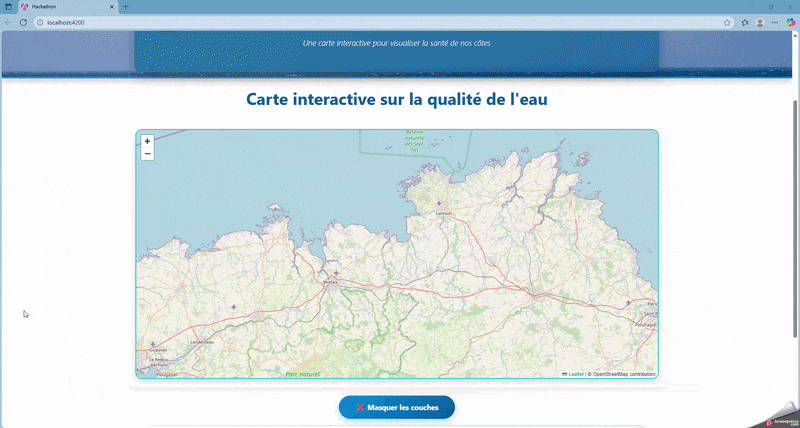

# hackathon-ocean

## Contexte
POC réalisé lors du Hackathon Ocean de Brest 2025.  
Projet SIG pour An Dour Morlaix.

## Objectif
Proposer un prototype d'outil cartographique accessible à tous pour s'informer sur la qualité des eaux dans la baie de Morlaix, notamment au niveau des polluants. L'entiereté du projet a du être réalisé en moins de 48h.

## Public cible
- Conchyliculteurs de la baie de Morlaix
- Agriculteurs (épandage de produits phytosanitaires)
- Grand public (outil d'information générale)

## Fonctionnalités
- Visualisation en temps réel de la qualité de l'eau
- Affichage des polluants présents
- Interface simple et accessible

## Démonstration

## Technologies et supports utilisés
- Typescript / Angular
- Génération de code par IA
- Données géométriques fournies sous forme de shapefiles par le service public de l'eau An dour de Morlaix

## Note
Ce projet a été développé avec l’aide d’outils d’intelligence artificielle (IA Claude) pour accélérer la conception et le développement.

---
